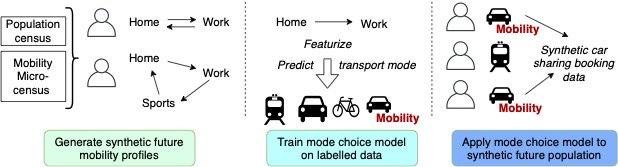

# Car sharing simulator

This repository provides the code for our open-source car sharing simulator. The simulator is agent-based and only requires a population and their activity patterns as input. We have trained a mode choice model on tracking data from Switzerland, and this model is applied on the activity to generate car sharing data. The steps to simulate car sharing reservation data are described in detail in the following.



### Installation

The required packages and our car sharing package can be installed via pip in editable mode in a virtual environment with the following commands:
```
git clone https://github.com/mie-lab/car_sharing_simulator.git
cd car_sharing_simulator
python -m venv env
source env/bin/activate
pip install -e .
````

## Car sharing simulation with the given example data

To allow execution of our pipeline, we provide example data within this repository. To simulate car sharing trips based on that data, simply execute the following command:

Download XML file [here](https://github.com/matsim-org/matsim-libs/blob/master/examples/scenarios/siouxfalls-2014/Siouxfalls_population.xml.gz).
Convert activity-XML into trips-csv file
```
python scripts/activities_to_trips.py
```
Simulate stations based on the population distribution
```
python scripts/simulate_stations.py
```

Transform trips-data into input features to the mode choice model:
```
python scripts/add_features.py
```
Download the mode-choice prediction models [here](https://polybox.ethz.ch/index.php/s/U6Ge2Sb49rnRzV6) and copy the models from the `trained_models` folder in the zip to the `trained_models` folder in this repository. The [model tutorial](trained_models/model_usage_tutorial.ipynb) shows you how to use the models.

Run car sharing simulation
```
python scripts/generate_car_sharing_data.py -i data/siouxfalls_trips_features.csv -o outputs/siouxfalls_sim -m trained_models/xgb.p -s data/stations.csv
```

Plot the results (figures will be saved in the output folder `outputs/siouxfalls_sim` by default)
```
python scripts/visualize_reservations.py
```


## Car sharing simulation with your own data

If you use your own data, you basically follow the same steps as above, but can replace the input trips, the input stations and the mode choice model by your own data. We describe in the following how you can produce own data in similar format for other locations.

### Generating a synthetic population

Our agent-based simulator is based on a population and their activity patterns. By activity patterns we mean the start and end times and locations of their activities over one day. Such data can be generated with [Equasim](https://github.com/eqasim-org/), a synthetic-population framework published by the IVT group at ETH Zürich. Their pipeline uses census data and transport survey data to simulate activity patterns and living / working locations of people. It also allows to scale the population for the purpose of studying future car sharing behaviour.

We used their pipeline but adapted it to **sample car sharing users** from the overall population. We sample car sharing users with stratisfied sampling based on the distance of the people to the next car sharing station. See our [script](https://github.com/mie-lab/v2g4carsharing/blob/master/v2g4carsharing/simulate/draw_car_sharing_population.py) for this code.

We allow for any kind of activity patterns as input, and do not restrict the input to equasim-outputs. The **activity patterns must simply be of a similar form as the example data data** in the `data` folder, at least when you are using our mode choice model (see section about the mode choice model below). If you want to use our mode choice model and have equasim-like trip-data, you can use our scripts `scripts/activities_to_trips.py` and `scripts/add_features.py` to featurize the trips, as described above.

### Create car sharing stations

Car sharing stations can either be simulated randomly based on the population density, or provided by the user. An example is given in the `data` folder. To generate random car sharing stations based on the population data, run

We need to make a scenario which car sharing stations exist and what vehicles are available at these stations. We do this with a modified version of the KMEans algorith, were some cluster centers (aka stations) are fixed. You can use your own data for the fixed stations by saving them as data/existing_stations.csv (with two columns x and y).

Usage:
```
simulate_stations.py [-h] [-i INP_PATH] [-o OUT_PATH] [-f FIXED_STATIONS] [-n NUMBER_STATIONS]

optional arguments:
  -h, --help            show this help message and exit
  -i INP_PATH, --inp_path INP_PATH
                        Path to trips file
  -o OUT_PATH, --out_path OUT_PATH
                        Path where to output the simulated stations
  -f FIXED_STATIONS, --fixed_stations FIXED_STATIONS
                        Path to fixed stations that are already there
  -n NUMBER_STATIONS, --number_stations NUMBER_STATIONS
                        How many stations to place
```

### Choose a mode choice model

The mode choice model is the most important part of the simulation. It decides when people use car sharing for their trips. We provide a mode choice model (download [here](https://polybox.ethz.ch/index.php/s/U6Ge2Sb49rnRzV6)), which is however trained on a dataset of users in Switzerland. Users in other cities may behave very differently, so you should decide carefully whether you want to use your own model. 

First, we **provide sample code for a very basic mode choice model** [here](carsharing/mode_choice_models.py) (class `BasicModeChoiceModel`). You can modify this code for a handcrafted mode-inference function.

Secondly, we provide two XGBoost models that were trained on the behaviour of car sharing users from the [MOBIS dataset](https://ivtmobis.ethz.ch/mobis/covid19/reports/latest#MOBIS-COVID19). They were trained on to use the following input features for inference (to assign a mode to a trip):
* feat_age: Age in years
* feat_sex: 1 = female, 0 = male
* feat_caraccess: 1 if the person owns a car, 0 else:
* feat_employed: 1 if the person is employed, 0.5 if part time, 0 if unemployed
* feat_distance: Distance from origin to destination (in m)
* feat_purpose_destination_home: 1 if the destination is the home location, else 0
* feat_purpose_destination_leisure: 1 if the destination is visited for leisure, else 0
* feat_purpose_destination_work: 1 if the destination is visited for work, else 0
* feat_purpose_destination_shopping: 1 if the destination is visited for shopping, else 0
* feat_purpose_destination_education: 1 if the destination is visited for education, else 0
* feat_purpose_origin_home: 1 if the origin is visited for leisure, else 0
* feat_purpose_origin_leisure: 1 if the origin is visited for leisure, else 0
* feat_purpose_origin_work: 1 if the origin is the home work, else 0
* feat_purpose_origin_shopping: 1 if the origin is visited for shopping, else 0
* feat_purpose_origin_education: 1 if the origin is visited for education, else 0
* feat_pt_accessibilityorigin: Public transport accessibility at the origin location (Score from 0 to 4, 0=unknown, 1=bad PT accessibility (class D in Swiss system), 4=excellent accessibility (class A in Swiss system) - see [here](file:///Users/ninawiedemann/Downloads/oev-gueteklassen-berechnungsmethodikare.pdf) for the Swiss system)
* feat_pt_accessibilitydestination: Public transport accessibility at the destination location (Score from 0 to 4, 0=unknown, 1=bad PT accessibility, 4=excellent accessibility)
* feat_distance_to_station_origin: Distance of the origin location to the closest car sharing station (in m)
* feat_distance_to_station_destination: Distance of the destination location to the closest car sharing station (in m)
* feat_origin_hour: Hour of the day when starting the activity at the origin location - number from 0 to 24
* feat_origin_day: Weekday when at origin location (Number from 0 to 6)
* feat_destination_hour: Hour of the day when starting the activity at the origin location - number from 0 to 24
* feat_destination_day: Weekday when at destination location (Number from 0 to 6)

You can also train an XGBoost model on your own data with our code. For this purpose, run
```
python train_mode_choice_model.py [-h] [-s MODEL_SAVE_PATH] [-i IN_PATH_MOBIS] [-o OUT_PATH]

optional arguments:
  -h, --help            show this help message and exit
  -s MODEL_SAVE_PATH, --model_save_path MODEL_SAVE_PATH
                        path to save model
  -i IN_PATH_MOBIS, --in_path_mobis IN_PATH_MOBIS
                        path to mobis feature dataset
  -o OUT_PATH, --out_path OUT_PATH
                        path to save training results
```
The model is by default saved as `trained_models/xgb.p` and the test and train performance evaluation is saved in `outputs/mode_choice_model` by default.

### Run simulation

Execute the following command by pointing to your population with the -i flag and to your stations with the -s flag:
```
python scripts/generate_car_sharing_data.py [-h] [-i IN_PATH_SIM_TRIPS] [-o OUT_PATH] [-s STATION_SCENARIO] [-m MODEL_PATH] [-t MODEL_TYPE]

optional arguments:
  -h, --help            show this help message and exit
  -i IN_PATH_SIM_TRIPS, --in_path_sim_trips IN_PATH_SIM_TRIPS
                        path to simulated trips csv
  -o OUT_PATH, --out_path OUT_PATH
                        path to save output
  -s STATION_SCENARIO, --station_scenario STATION_SCENARIO
                        path to station_scenario
  -m MODEL_PATH, --model_path MODEL_PATH
                        path to mode choice model
  -t MODEL_TYPE, --model_type MODEL_TYPE
                        one of rf or irl
```

For the model, you can train a model or use on of our pretrained models, which you can download [here](https://polybox.ethz.ch/index.php/s/U6Ge2Sb49rnRzV6). The usage of these models and their supported inputs and outputs is described in the [tutorial](trained_models/model_usage_tutorial.ipynb).


